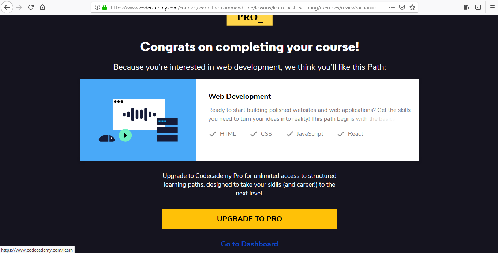
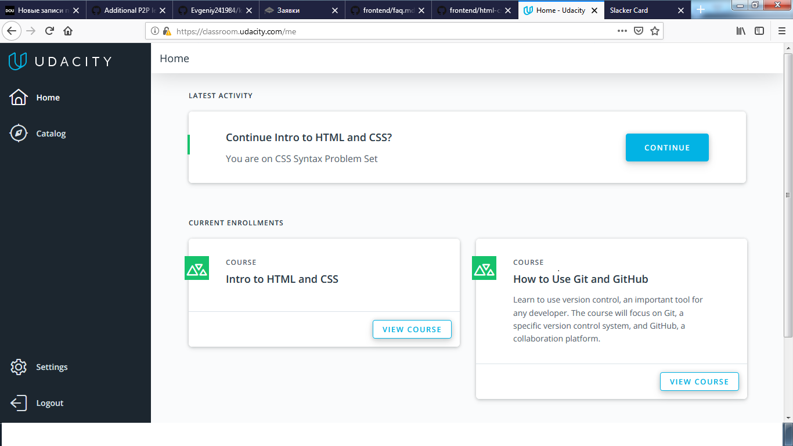
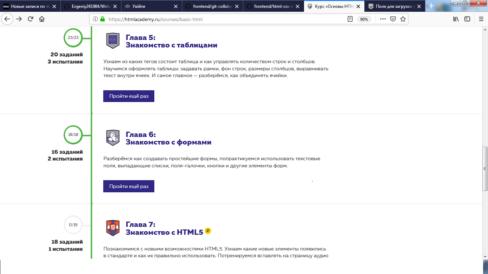
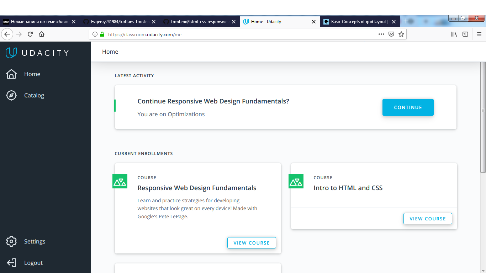
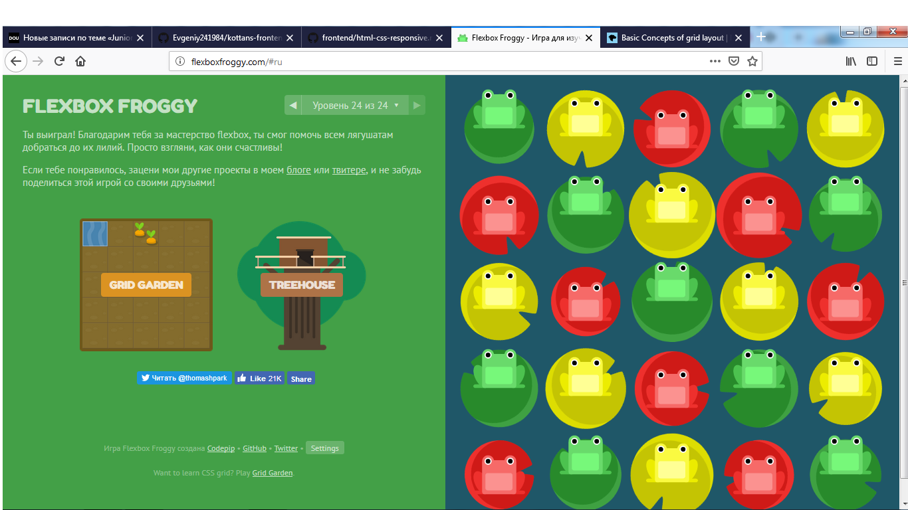
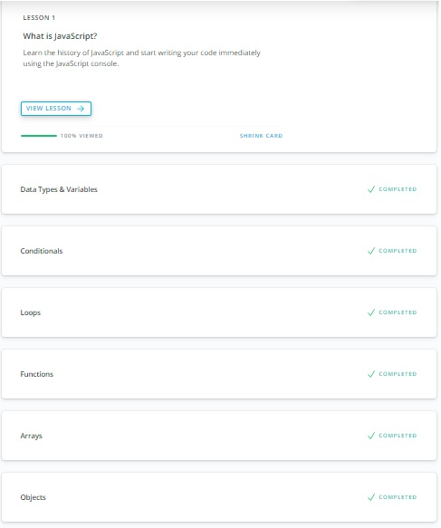
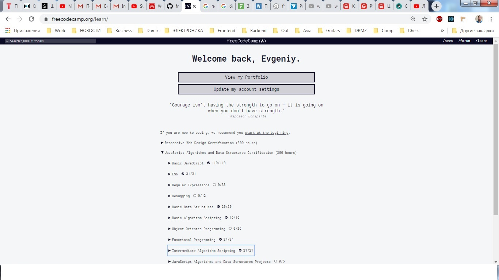
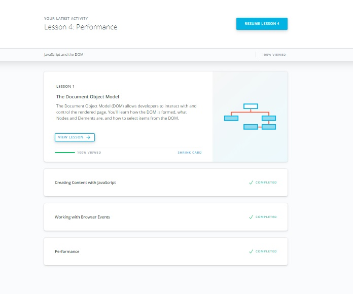
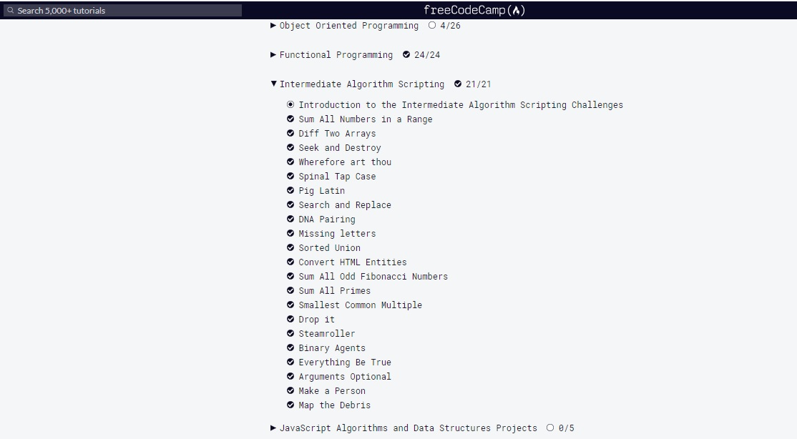

## 1. Linux CLI, and HTTP

## 2. Git Collaboration

## 3. Intro to HTML and CSS

## 4. Responsive Web Design

## 5. HTML & CSS Practice
[Repo]( <https://github.com/Evgeniy241984/frontend-2021-homeworks/tree/html-css-popup/submissions/evgeniy24/html-css-popup-demo>)

## 6. JS Basics

## 7. DOM

## 8. Building a Tiny JS World (pre-OOP)

[Repo](https://github.com/kottans/frontend-2021-homeworks/blob/main/submissions/evgeniy24/a-tiny-JS-world/index.js)

## 9. Object oriented JS

[CodeWars](https://www.codewars.com/users/Evgeniy241984)

