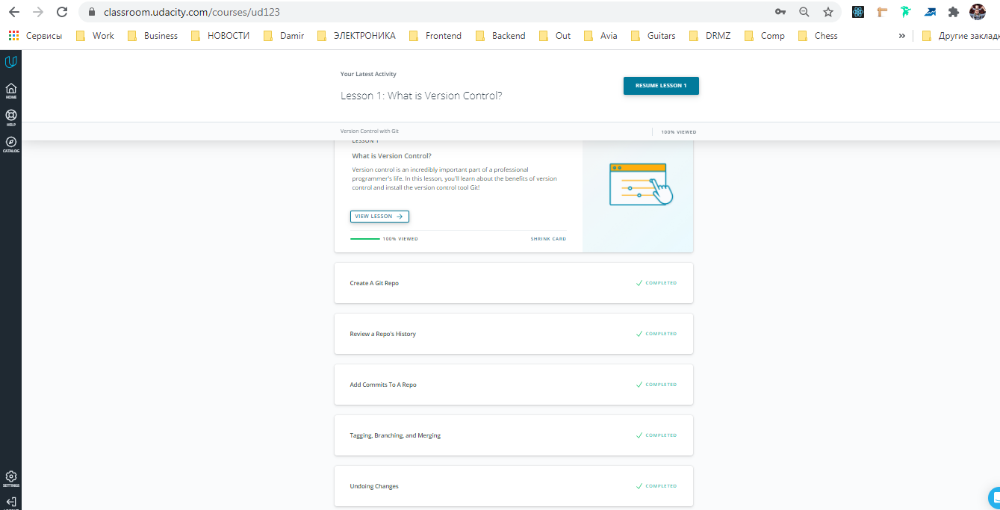
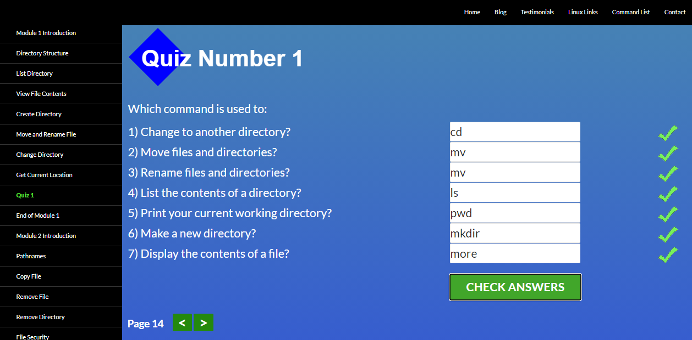
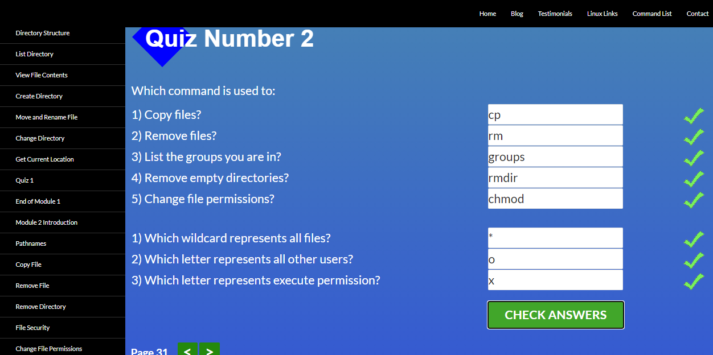
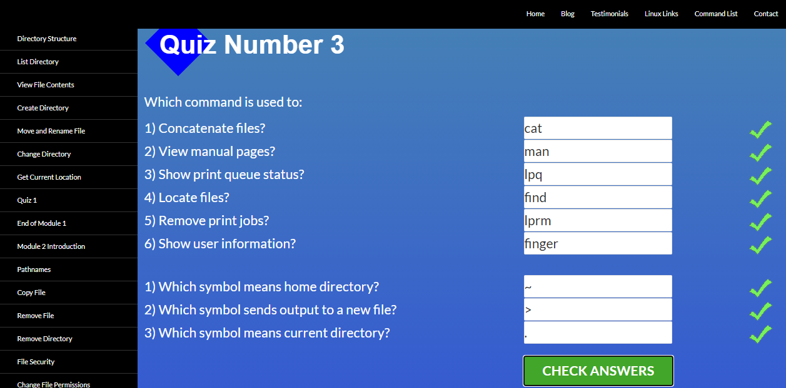
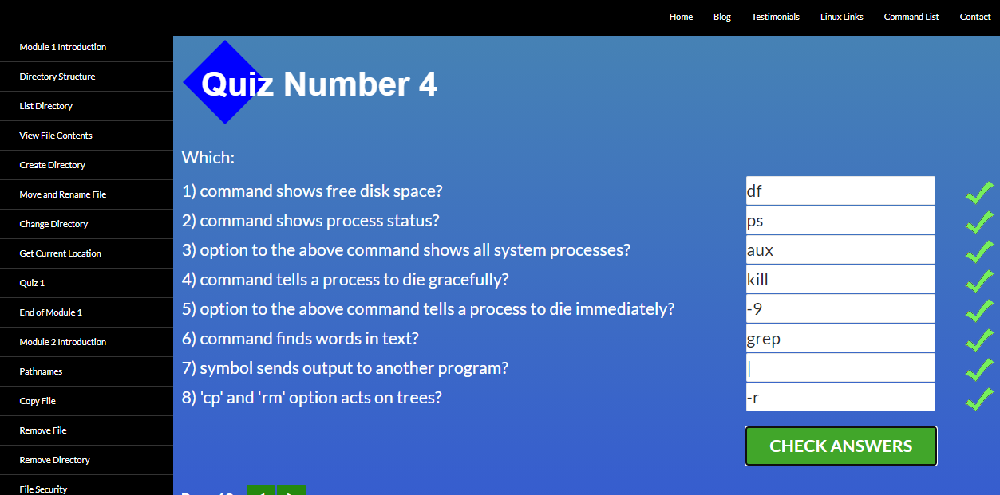
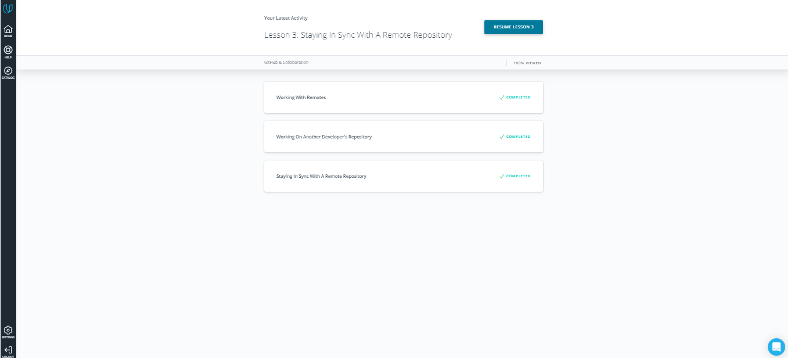
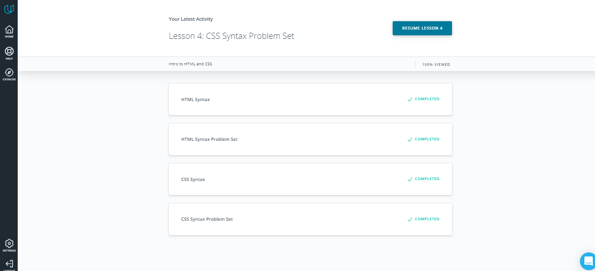
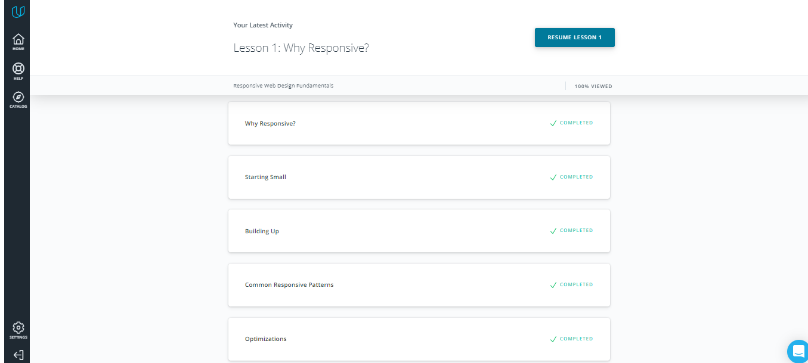
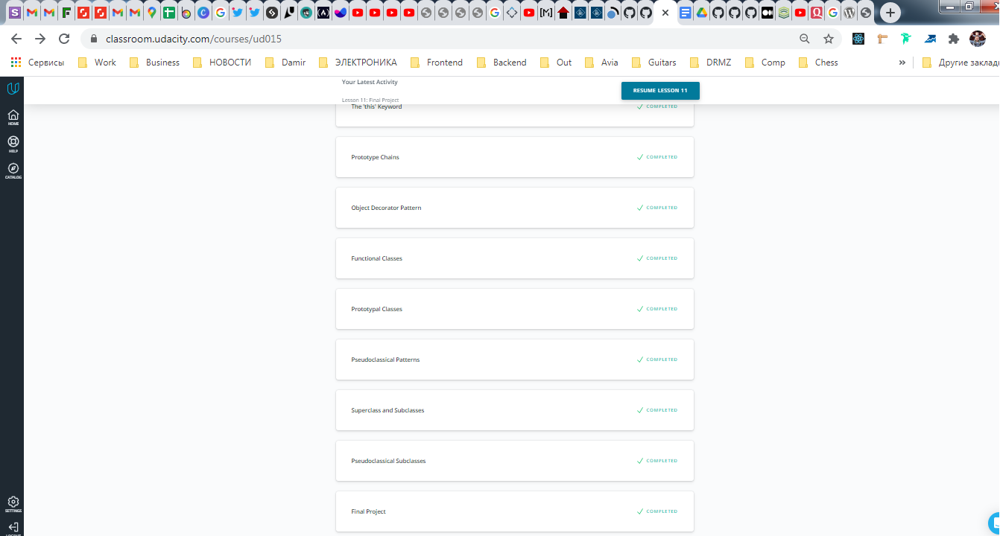

## 0. Git Basics

Git and GitHub

## 1. Linux CLI, and HTTP

Linux Survival (4 modules)

## 2. Git Collaboration

GitHub & Collaboration

## 3. Intro to HTML and CSS

Intro to HTML_CSS

## 4. Responsive Web Design

Responsive Web Design Fundamentals

FlexBox Froggy

## 5. HTML & CSS Practic

[HTML CSS Repo](<https://github.com/Evgeniy241984/frontend-2021-homeworks/tree/html-css-popup/submissions/evgeniy24/html-css-popup-demo>)

## 6. JS Basics

Intro to JS

FreeCodeCamp exercises

## 7. DOM

JavaScript and the DOM

Freecodecamp Algorithm Scripting Challenges

Practical task

[Practical task Repo](https://github.com/Evgeniy241984/frontend-2021-homeworks/tree/js-dom/submissions/evgeniy24/js-dom)

## 8. Building a Tiny JS World (pre-OOP)

[TinyJS World Repo](https://github.com/kottans/frontend-2021-homeworks/blob/main/submissions/evgeniy24/a-tiny-JS-world/index.js)

## 9. Object oriented JS

Object Oriented JS

Codewars profile

[CodeWars Profile](https://www.codewars.com/users/Evgeniy241984)

## 10. OOP exercise

[Tiny World OOP](https://github.com/Evgeniy241984/frontend-2021-homeworks/tree/tiny-world/submissions/evgeniy24/a-tiny-JS-world)

## 11. Memory pair game

[PR#173 link](https://github.com/kottans/frontend-2021-homeworks/pull/173)
